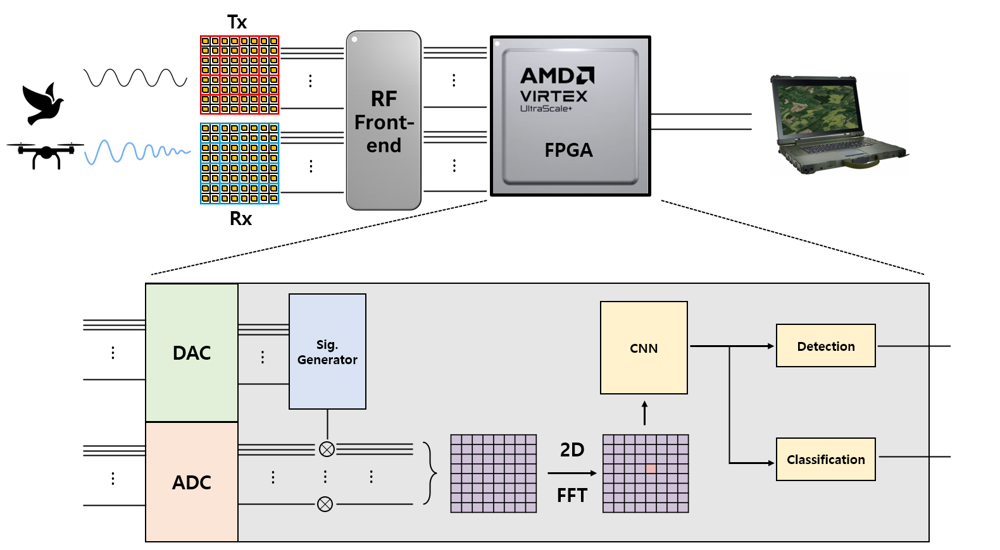
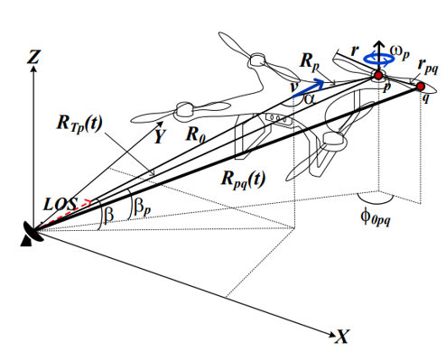
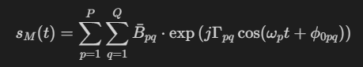
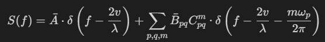
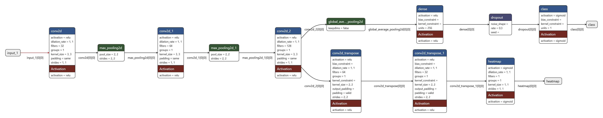
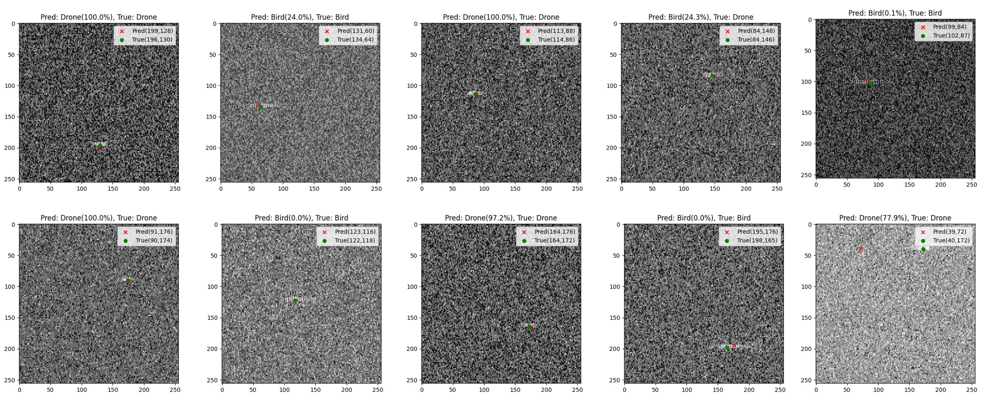
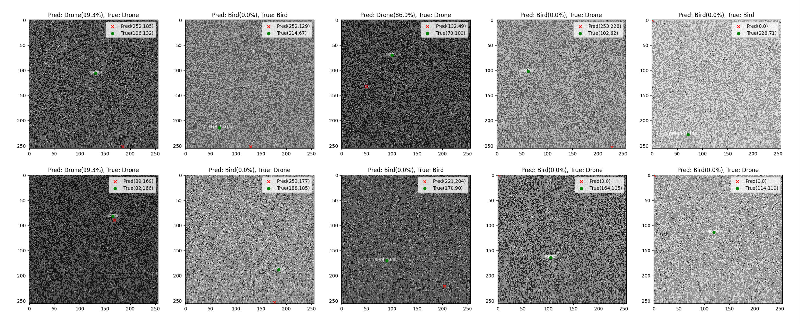
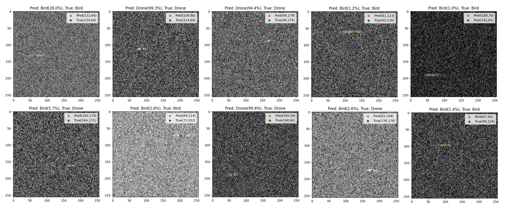
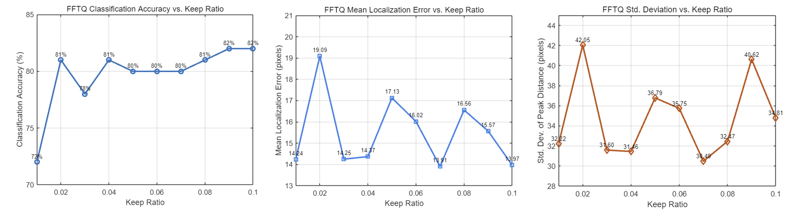
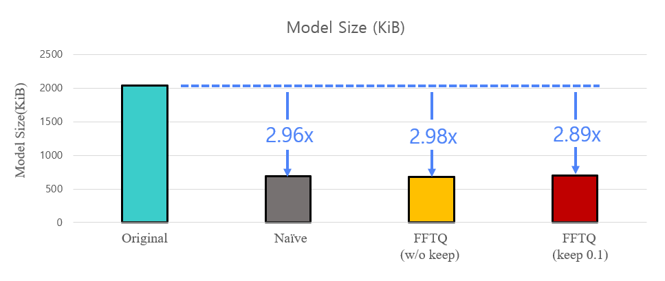

# FFTQ : FFT-Based 4-Bit Quantization for Deep Learning Models in Target Detection and Identification on FPGA-Driven Digital Radar
#### Junho Jeong, EE@POSTECH
#### junhojeong@postech.ac.kr

## Introduction

**Figure 1.** Architecture of the FPGA-based digital radar and subsystem.

This blog post addresses the problem of distinguishing between drones and birds using deep learning, based on Range-Doppler(RD) 2D maps generated from a drone detection radar system. Unlike traditional radars based on analog circuits, modern radars analyze transmitted and received signals through digital signal processing using digital IC chips. In this process, to increase the level of integration in the radar system, an RFSoC chip is used that combines FPGA (Field Programmable Gate Array), DAC, and ADC. If the FPGA’s software design is well-optimized, it can be utilized similarly to an NPU ([A. Boutros et al, 2020](https://ieeexplore.ieee.org/document/9415606)). However, since FPGAs physically lack the level of parallel processing capability found in GPUs, a specially designed deep learning model is needed.

Moreover, there is a growing need for drone detection radar systems to be operated by small unit teams at the forefront of the battlefield. Considering this, the overall volume and weight of the radar system must be miniaturized and lightweight enough for a single person to carry. Therefore, carrying high-performance workstations is nearly impossible, and we are not afforded the opportunity to use high-performance parallel computing units like GPUs. Given this, it becomes evident that distinguishing between drones and birds using deep learning in a drone detection radar system requires a specialized deep learning model that can run on an FPGA.

To address this, we design a lightweight deep learning model that can actually run on FPGA, and we analyze its structural characteristics and efficiency. In particular, although it is not physically implemented, the model is designed with realistic resource constraints (LUT, DSP, etc.) in mind, based on a high-performance FPGA board such as the Xilinx ZCU216. The model architecture uses CNN to first detect the presence of a target in each frame. Subsequently, if a target is detected, the process of identifying what that target is follows. This post specifically focuses on distinguishing between drones and birds ([Rahman et al, 2019](https://ietresearch.onlinelibrary.wiley.com/doi/epdf/10.1049/iet-rsn.2019.0493)) as representative cases. 
The core question is: “Can a lightweight structure sufficiently learn RA 2D map-based information to distinguish between drones and birds?” With this, we present a model design case that takes into account both real-time inference and practical deployability in the field.

In this post, we first generate and train a simple CNN model with FP32-level weights and activations. However, performing floating-point operations on an actual FPGA is challenging ([V. Sze et al, 2017](https://ieeexplore.ieee.org/document/8114708)). Therefore, an integer-based model is required. The ADC in the FPGA we use samples the received analog signals as 16-bit integers. However, with a sampling rate of approximately 2.5 GSPS and simultaneous sampling across 16 receive channels, the volume of data that must be processed per second is extremely large. Thus, the radar system assumed in this post will quantize the incoming int16 data to int4 for use. Additionally, since the trained CNN model’s FP32 weights and activations are difficult to use on an FPGA, we will perform quantization of the CNN model using the Post-Training Quantization (PTQ) method ([M. Nagel et al, 2021](https://arxiv.org/abs/2106.08295)). Ultimately, the core of this blog post lies here: “How can we quantize the model to int4 while maximizing the detection and identification performance of the existing CNN model?” In the following sections, we will explore insights from the signal processing perspective of the RA 2D maps used as input data and apply them to demonstrate a quantization method.

## Why the topic is a meaningful contribution to the society?
Small drones have shown their effectiveness in modern warfare, particularly in the Ukraine–Russia conflict, and are now increasingly being used in acts of terrorism targeting civilians. As a result, detecting the approach of drones in advance has become a critical issue. However, because drones and birds share similar size and movement characteristics in the air ([Gong, Jiangkun, et al, 2019](https://www.jpier.org/pierm/pier.php?paper=19020505)), distinguishing between them requires a large-scale AI model capable of accurately extracting their unique features.

In practice, radar systems often rely on FPGA, a type of embedded hardware. This creates a challenge: to run deep learning models in real time on such a system, the models must be lightweight and highly efficient. However, research in this area, developing lightweight AI models specifically optimized for FPGA deployment, is still limited.

This study investigates the problem from a deployable, real-time perspective. It presents an efficient AI model that can operate directly on embedded hardware, making it highly practical for real-world applications. In the long term, this approach can contribute to public safety and more effective airspace surveillance, particularly in domains where low power consumption and portability are essential, such as radar systems powered by FPGAs and lightweight deep learning architectures.

## Radar Signal Processing and Simulation
<table>
  <tr>
    <td style="vertical-align: top; text-align: center;">
       
      Figure 2. Illustration of a drone during motion properties.
    </td>
    <td style="vertical-align: top; padding-left: 15px;">
      The key feature for detecting and identifying drones and birds lies in the Micro-Doppler effect (Kang, et al, 2021). The Micro-Doppler effect is a phenomenon where additional frequency modulation is induced in the radar reflection signal due to the fine vibrations or rotational movements of a target. In particular, periodic micro-motions such as the rotation of a drone’s propellers or the flapping of a bird’s wings generate a unique time-frequency spectrum, which can be utilized as critical information for target identification (Rahman, S, 2018).
Both drones and birds induce temporally modulated Doppler frequency components in the radar reflection signal based on their periodic rotations. These micro-motions add periodic harmonic components on top of the general translational Doppler shift, resulting in the formation of a Micro-Doppler spectrum (Zhang, Yimin D., et al., 2021). This spectrum is commonly observed in radar 2D RDMaps as periodically generated peak patterns along the Doppler axis.
However, in the case of drones, the drone propellers rotate at a relatively constant angular velocity, generating integer multiple harmonic components in the radar signal. As a result, the Micro-Doppler spectrum exhibits a line-spectral structure, including symmetrically distributed chopping frequency components around the central Doppler frequency.
    </td>
  </tr>
</table>

This chopping frequency is defined as follows:

$$f_c = (N * ω_p) / (2π)$$

  $N$ : The number of blades on each propeller\
  $\omega_p$ : Angular velocity (rad/s)

  In contrast, birds perform flapping motions, resulting in high variability in their motion cycles and amplitudes. This leads to an irregular micro-Doppler spectrum, exhibiting a spectrum spreading phenomenon. In particular, the flapping of bird wings is generally concentrated in the low-frequency region below 18 Hz ([Molchanov, Pavlo, et al.](https://www.cambridge.org/core/journals/international-journal-of-microwave-and-wireless-technologies/article/abs/classification-of-small-uavs-and-birds-by-microdoppler-signatures/C5A57FC02BBC4261CE563738ED9D6D76)), making it difficult to exhibit integer multiple chopping components and resulting in a broad energy distribution across the frequency domain. Notably, due to the asymmetrical flapping of the left and right wings, the Doppler spectra on either side of the central Doppler frequency are distributed asymmetrically.

The micro-Doppler signal of a UAV can be modeled as follows based on the reflections from the body and the rotating propellers:

$\Gamma_{pq}$ :  Gamma function\
$\phi_{0pq}$ : Initial phase\
$r_{pq}$ : The radius of rotation of the scattering body of the corresponding propeller blade\
$\omega_p$ : The angular velocity of the ${p}^{th}$ propeller

 When this signal is transformed into the frequency domain using the Jacobi-Anger expansion, the following multiple spectral components are obtained:

$m$ : Harmonic order\
$\delta(f)$ : Dirac delta function\
$C_{pq}^m$ : Bessel function coefficient

 This demonstrates that the micro-Doppler spectrum of a UAV consists of multiple harmonic components symmetrically positioned around the central frequency. \
 In contrast, in the case of birds, no such structured pattern exists, and only an irregular, broad-bandwidth spectrum is observed.

 
**Figure 3.** Micro-Doppler datasets Simuation of drone and bird.

Figure 3. shows a 2D Range-Doppler Map generated from the micro-Doppler simulation of drones and birds.

## Model Architecture

 
**Figure 4.** A dual-branch convolutional neural network designed to localize and classify targets from radar 2D RD Maps.

This post designs a dual-purpose CNN architecture that predicts the location of a target from a radar Range-Doppler(RD) Maps and classifies whether the target is a drone or a bird. The input is a single-channel RD map of size \(256 \times 256 \times 1\), and the outputs are a 2D heatmap and a binary class probability.  
The model’s encoder consists of three convolutional layers and two max-pooling layers. The extracted features are then processed through two branches:

- **Heatmap Decoder**: The feature map from the encoder is progressively upsampled through two transposed convolutional layers (Conv2DTranspose) to restore the original input resolution of \(256 \times 256\). This decoder is used to predict the per-pixel probability of target presence ([Newell, A. et al, 2016](https://arxiv.org/abs/1603.06937)). The final output layer applies a \(1 \times 1\) convolutional kernel and a sigmoid activation function to quantify the likelihood of a target at each position as a value between 0 and 1. This output is trained to approximate a 2D Gaussian distribution (i.e., a probability map centered at the target’s location) provided as the label, enabling high-resolution estimation of the target’s position by leveraging the spatial distribution of the radar signal.

- **Classification Branch**: The final feature map from the encoder undergoes Global Average Pooling to remove spatial dimensions, transforming it into a global summary vector across the channel dimension. This vector is passed through a fully connected (Dense) layer, with ReLU activation and Dropout applied in between to promote generalization ([Srivastava, N. et al, 2014](https://www.cs.toronto.edu/~rsalakhu/papers/srivastava14a.pdf)). The final output layer consists of a single neuron with sigmoid activation, performing binary classification to determine whether the target in the input RD map is a drone (1) or a bird (0). This branch is trained to capture subtle micro-Doppler characteristics and energy distribution differences of the target.

For the two outputs, individual binary cross-entropy losses are defined, and the total loss is formulated as follows:

$$
\mathcal{L}_{\text{total}} = \mathcal{L}_{\text{heatmap}} + \lambda \cdot \mathcal{L}_{\text{class}}, \quad \lambda = 3.0
$$

where,

$
\mathcal{L}_{\text{heatmap}} = - \frac{1}{HW} \sum_{i,j} \left[ y_{ij} \log(\hat{y}_{ij}) + (1 - y_{ij}) \log(1 - \hat{y}_{ij}) \right]
$

$
\mathcal{L}_{\text{class}} = - \left[ y \log(\hat{y}) + (1 - y) \log(1 - \hat{y}) \right]
$

This model combines an encoder-decoder-based localization structure with a global summary-based classifier, enabling the simultaneous and accurate prediction of both the target’s position and type on the RDMaps. Furthermore, through multi-task learning, it facilitates feature sharing between the two tasks, thereby enhancing both learning efficiency and generalization performance.

## Quantization Method
This post proposes a method for quantizing weights and activations to int4 using an FFT-based approach in a deep learning model that takes 2D radar RDMaps as input. While traditional 4-bit quantization ([Hubara et al., 2017](https://arxiv.org/abs/1609.07061)) often employs naïve quantization using min/max or a normalized distribution ([Tim Dettmers et al, 2023](https://arxiv.org/abs/2305.14314)), the proposed technique processes important components more finely in the frequency domain, reducing errors and maintaining or even improving performance.

First, the input data for the deep learning model in this post consists of 2D radar RDMaps, where the received time-domain signal is transformed into the Range-Doppler domain using a 2D FFT, resulting in a processed signal. The model performs dual-branch outputs: classifying the target as a bird (0) or a drone (1) while simultaneously predicting the target’s position 
$(\text{range\_idx}, \text{doppler\_idx})$ on the RDMap as a heatmap.

When the trained model’s weights are flattened, they can be represented as:

$$
\mathbf{w} \in \mathbb{R}^{n}
$$

To apply 4-bit quantization in the frequency domain, a 1D FFT is performed on $ \mathbf{w} $. Mathematically,

$$
\mathbf{W} = \text{FFT}(\mathbf{w})
$$

where $ \mathbf{W} $ is the complex frequency-domain representation of the weight vector. A larger magnitude $ |\mathbf{W}[k]| $ indicates that the corresponding frequency component is more significant.

The proposed strategy is as follows:

1. Retain the top $ K\% $ of frequency components (i.e., those with the largest $ |\mathbf{W}[k]| $) in full precision (int32).
2. Quantize the remaining frequency components to 4 bits.

In other words, high-energy components are preserved to maintain model accuracy, while less critical components are aggressively quantized. The quantization is performed via rounding and clipping, either using global min/max or within a fixed range such as:

$$
\{-7, -6, \dots, 7, 8\}
$$

For each discarded frequency component $ \mathbf{W}[k] $, we separately quantize the real and imaginary parts.

After quantization, the following process is used to reduce each real-valued component to 4 bits using min-max linear quantization.

Let:

$$
x_{\min} = \min(\Re(\mathbf{W}[k])), \quad 
x_{\max} = \max(\Re(\mathbf{W}[k])), \quad 
\text{scale} = \frac{x_{\max} - x_{\min}}{15}
$$

Then quantization and dequantization are performed as:

$$
q = \text{clip}\left( \text{round}\left( \frac{x - x_{\min}}{\text{scale}} \right), 0, 15 \right), \quad 
\tilde{x} = q \cdot \text{scale} + x_{\min}
$$

After quantizing both the real and imaginary parts, the frequency components are reconstructed as:

$$
\tilde{\mathbf{W}} = \Re(\mathbf{W}[k]) + i \, \Im(\mathbf{W}[k])
$$

Then, an inverse FFT is applied to obtain the quantized weights in the spatial domain:

$$
\tilde{\mathbf{w}} = \text{iFFT}(\tilde{\mathbf{W}})
$$

If this approach is applied to **all frequencies** (i.e., `keep_ratio = 0.0`), the absence of high-precision components can significantly degrade accuracy. However, by **partially retaining** (e.g., `keep_ratio = 0.1`) some components in `int32`, critical information, especially low-frequency components, is preserved, while high-frequency noise is aggressively quantized to 4 bits.

For instance, with `keep_ratio = 0.1`, the top 10%
 of frequencies (those with the highest magnitude in the FFT domain) are preserved in FP32, while the remaining 90% 
 are quantized. Since FP32 operations are not feasible on many deployment targets like FPGAs, the retained components are converted to `int32` or similar formats for compatibility.

Activations can also be quantized using a similar frequency-domain quantization process, ensuring consistent compression across weights and intermediate features.

## Experimental Results

The training dataset consists of 1,000 drone simulation model images and 1,000 bird simulation model images, while the test dataset comprises 400 drone simulation model images and 400 bird simulation model images. In the training simulation data, the Signal-to-Noise Ratio (SNR) of the main body of drones and birds is approximately 6.5 dB, while the SNR of the micro-Doppler is about -9.5 dB. The signal strength and noise strength vary slightly across images as they follow a Gaussian random distribution.

The experimental results consist of a comparison between the FP32 model, the Naïve quantization model, and the FFTQ 4-bit quantization model. First, the results of the target location and type identification predicted by the FP32 model are presented. The figure below shows the results of the original FP32 deep learning model simultaneously predicting the target’s location and type (drone/bird) based on RDMaps. In each image, a red ‘×’ indicates the predicted location, a green circle represents the actual location, and the top of the image displays both the predicted and actual classes.

 
**Figure 5.** Detection and Classification results of the original FP32 Dual-branch model.

The overall test results show a classification accuracy of 81%
, correctly identifying most targets. In particular, for confident samples, the predicted probabilities often approach 100%,
 demonstrating high reliability in the model’s classification performance.

The location accuracy is measured at an average of 14.52 pixels with a standard deviation of 30.59, indicating that while the model predicts locations relatively accurately in most cases, there are instances with significant errors. These results suggest that the original model exhibits meaningful performance in both detection and classification, even in noisy environments, and can serve as a performance baseline for future quantization or lightweighting applications.

 
**Figure 6.** Detection and Classification results of the naive quantization model.

The figure above visualizes the prediction results of a model quantized to 4 bits (naïve PTQ) using a simple min/max-based normalization method for weights and activations, based on the original model. Each subplot displays the predicted target location and classification result for a single test RD map. The overall test performance of the quantized model showed a classification accuracy of 55.75 percent, with an average location error of 149.11 pixels and a location error standard deviation of 60.20 pixels.

Compared to the original model (classification accuracy of 81%,
 average location error of 14.52 pixels, std of 30.59 pixels), the quantized model’s classification accuracy dropped by about 25 percentage points, and the location error increased over tenfold. In drone/bird classification, confidence scores often skewed to 0%
  or 100%
   but frequently mismatched the actual class, indicating a distorted decision boundary due to quantization([Banner et al., 2019](https://arxiv.org/abs/1810.05723)). Additionally, heatmap-based location predictions showed unstable outputs with strong peaks in unrelated locations, as the naïve PTQ method failed to preserve the model’s high-dimensional representation capabilities. These results show that simple normalization-based PTQ is unsuitable for real-world radar scenarios, while the original model performed more stably, highlighting the need for advanced quantization methods like FFT-based selective quantization to maintain performance.

 
**Figure 7.** Detection and Classification results of the 4-bits FFPQ model.

The figure above illustrates the prediction results of the model applying the Fourier-based 4-bit Quantization (FFTQ) technique proposed in this study. This model compresses both weights and activations to 4 bits, designed to process all components uniformly in the frequency domain, and was evaluated in a fully quantized environment (keep_ratio = 0.0%) 
without preserving high-precision components.

Evaluated on a total test dataset of 400 samples, the model achieved a classification accuracy of 73.00%, with an average location error of 36.15 pixels and a standard deviation of 60.14 pixels. Despite quantization, this performance shows minimal degradation compared to the original model. Specifically, the classification accuracy dropped by only 8 percentage points compared to the original, and the predicted locations converged within a range of tens of pixels, confirming that the model maintains sufficient precision for practical system applications.

FFT-based quantization transforms weights into the frequency domain for precise compression and reconstruction, effectively preserving low-frequency key information while reducing high-frequency noise components. This approach minimized performance loss while achieving an extreme compression rate at the 4-bit level, demonstrating its potential as an efficient model lightweighting strategy for real-time embedded systems or FPGA-based radar systems.

In conclusion, even without preserving high-precision components `keep_ratio = 0.0` , FFT-based refined quantization significantly outperformed the naïve approach. Its ability to achieve 4-bit implementation with minimal performance loss compared to the original model highlights its high practical value.

#### Model Comparison

| Model Type                    | Classification Accuracy (%) | Mean Localization Error (px) | Std. Dev. of Error (px) |
|-------------------------------|------------------------------|-------------------------------|--------------------------|
| Original (Full-Precision)     | 81.00                        | 14.52                          | 30.59                    |
| Naïve 4-bit PTQ               | 55.75                        | 149.11                         | 60.20                    |
| **Proposed FFTQ (4-bit, 0% keep_ratio)** | **73.00**                   | **36.15**                      | **60.14**                |

**Table 1.** Performance comparison of quantization models.

#### Keep_ratio Analysis

The proposed FFTQ 4-bit technique was tested by varying the keep_ratio from 0.01 to 0.10, revealing the following trends across three key performance metrics: classification accuracy, mean peak distance, and standard deviation of location error (Std. Dev.).

 
**Figure 8.** Performance evaluation based on keep_ratio, listed in order from left : classification accuracy, mean localization error, standard deviation of localization error.

The proposed FFTQ 4-bit technique was tested by varying the keep_ratio from 0.01 to 0.10, revealing the following trends across three key performance metrics: classification accuracy, mean peak distance, and standard deviation of location error (Std. Dev.).

- **Classification Accuracy vs Keep Ratio**\
The classification accuracy starts at 72% when the keep_ratio is 0.01(1%), rises sharply to 81% at 0.02, and then stabilizes around 80% thereafter. This indicates that preserving only a small number of high-energy components among the total frequency components is sufficient to restore the model’s primary classification capability. Notably, at keep_ratios of 0.09 to 0.10, the accuracy reaches 82%, slightly exceeding the original model’s level of 81%, confirming the efficiency of FFTQ in maintaining the original model’s accuracy even when only 1% to 10% of the weights and activations are preserved.

- **Mean Localization Error vs Keep Ratio**\
The mean peak distance, which indicates the accuracy of target location prediction, exhibits slight fluctuations but shows an overall gradual decreasing trend as the keep_ratio increases. This suggests that while noise components in the high-frequency domain are removed, critical location information in the low-frequency domain is effectively preserved. Encouragingly, for keep_ratios above 0.07, certain ratios achieve location prediction errors lower than the original model’s 14.52 pixels.

- **Std. Dev. vs Keep Ratio**\
The standard deviation, which reflects the stability of the error, remains within the range of 30 to 42 pixels overall, recording its lowest value of 30.49 at a keep_ratio of 0.07. Generally, as the keep_ratio increases, the standard deviation tends to either slightly decrease or converge to a stable level. This demonstrates that preserving key components during quantization positively contributes to ensuring output stability. However, temporary increases in standard deviation at certain intervals, such as 0.02 and 0.09, may reflect instability when the preserved components are not truly significant information ([Nagel et al, 2020](https://arxiv.org/abs/2004.10568)).

#### Model size
 
**Figure 9.** Comparison of Model Sizes Across Quantization Methods.

- **Naïve Quantization**
The naïve model, applying the simplest 4-bit quantization method, was compressed to approximately **686 KiB**, achieving a compression ratio of about **2.96 times**. This demonstrates that even when all weights and activations are uniformly reduced to 4 bits, significant lightweighting is possible.

- **FFTQ (keep_ratio = 0.0)**
When applying the proposed FFT-based quantization (FFTQ) technique with no high-precision (int32) components preserved (keep_ratio = 0.0), the model size is reduced to **682 KiB**, achieving a compression ratio of about **2.98 times**, slightly higher than naïve quantization. This suggests that quantization in the FFT domain can more effectively compress the distribution of weights and activations.

- **FFTQ (keep_ratio = 0.1)**
When the top 10%
 of frequency components are preserved in int32 and the remaining 90%
  are quantized to 4 bits, the overall model size is maintained at approximately **704 KiB**, corresponding to a compression ratio of about **2.89 times**. This result indicates that a high compression ratio can be preserved even while retaining some high-precision components, highlighting an efficient strategy that balances accuracy and capacity.

## Significance of FFT-Based Quantization for Radar

**1. Spectral Alignment of Input and Internal Representations**\
Radar RDMaps are originally generated through 2D FFT, making them frequency-domain data rather than spatial/time-domain images. This means the input itself consists of frequency information. 
Consequently, the internal structure of a deep learning model processing such input is likely to develop a frequency-based structure during training, with important information concentrated in low frequencies and noise present in high frequencies. Applying an additional FFT to weights or activations and varying precision by frequency component can thus be seen as a method that naturally aligns with the characteristics of the input data ([Sandler et al, 2018](https://arxiv.org/abs/1801.04381)).

**2. Compression Strategy Consistent with Physical Interpretation**\
RDMaps physically represent a combination of frequency components reflecting distance and velocity(Doppler frequency) ([Ritchie et al, 2020](https://arxiv.org/abs/2007.14366)). Analyzing these components in the frequency domain within the model and maintaining high precision only for the important ones can be considered an information compression approach that minimizes errors while preserving physical meaning.

**3. Noise Reduction and Generalization Effects**\
By removing or compressing high-frequency components (noise) to 4 bits using FFT, a generalization effect similar to normalization or denoising is achieved. This reduces model size while preventing overfitting and maintaining more stable performance on unseen data ([Zhiwei et al., 2025](https://arxiv.org/abs/2505.01043)).

## Compatibility with FPGA implementaion 

1. The ZCU216 FPGA offers sufficient hardware resources such as DSP slices, LUTs, and BRAM to support custom implementation of int4 computational modules. By designing a CNN accelerator using HDL or HLS, it is possible to construct a 4-bit integer pipeline for multiplication and accumulation, making inference fully executable on the hardware.

| Resource Type | Available (ZCU216) | Estimated Usage | Usage (%) |
|---------------|---------------------------|------------------|-----------|
| DSP Slices    | 4,272                     | ~300             | ~7.0%     |
| LUTs          | 930,000                   | ~50,000          | ~5.4%     |
| BRAM          | 4.88 MB (≈4,992 KB)       | ~350 KB          | ~7.0%     |

**Table 2.** Estimated ZCU216 FPGA Resource Usage.

2. Since the model parameters have been quantized offline using the FFT-based method and are constrained to the int4 range, there is no need for floating-point computation during inference. All operations can be handled entirely using integer arithmetic.

3. Even without relying on the Vitis AI DPU, a custom int4 CNN accelerator can be deployed on the ZCU216. Given the programmable nature of FPGAs, such an accelerator can also be implemented as a reusable IP core.

## Conclusion
This post investigated 4-bit quantization for a deep learning model processing 2D RDMaps inputs generated from radar signals, with the aim of deploying it on an FPGA. To address the limitations of naïve 4-bit quantization, an FFT-based 4-bit quantization approach(FFTQ) was attempted. While traditional 4-bit quantization employs a simple method that uniformly partitions all weights and activations using a single <math xmlns="http://www.w3.org/1998/Math/MathML"><semantics><mrow><mi>min</mi><mo>⁡</mo></mrow><annotation encoding="application/x-tex">  \min  </annotation></semantics></math> and <math xmlns="http://www.w3.org/1998/Math/MathML"><semantics><mrow><mi>max</mi><mo>⁡</mo></mrow><annotation encoding="application/x-tex">  \max  </annotation></semantics></math>, this approach fails to account for the distribution of fine details, potentially leading to significant performance loss. In contrast, FFT-based quantization transforms weights into the frequency domain, preserving only the frequency components with high energy while reducing the rest to 4 bits, thereby conserving critical information and effectively removing noise components. Experimental results showed that the accuracy either remained relatively high compared to naïve 4-bit quantization or, in some cases, even improved. This is interpreted as a result of a normalization effect achieved by maintaining low-frequency regions at high precision while suppressing high-frequency noise. The significance of this study lies in confirming that the approach of further transforming frequency-domain inputs like RDMaps into the frequency domain and limiting only certain components to 4 bits is effective in mitigating the accuracy degradation issues associated with low-bit quantization.

## Limitations
This post was conducted using a post-training quantization (PTQ) approach, which did not reflect the adaptation to quantization errors during the training process, as seen in Quantization Aware Training (QAT). Applying QAT could allow the network to adapt to the characteristics of FFT quantization, potentially leading to higher accuracy, suggesting that the QAT step, not utilized in this study, remains a clear potential area for further development. Additionally, while a qualitative interpretation of noise reduction or normalization effects has been provided regarding the principle behind the accuracy improvement with FFT quantization, a thorough validation or a quantitative analysis of the contribution of each frequency component was insufficient. As a result, a clear understanding of "which frequency components of which layers primarily drive the accuracy improvement" remains limited. Moreover, by relying on simulations or offline measurements rather than physical experiments in actual hardware environments like an FPGA, the study failed to directly verify the difficulty of hardware implementation, as well as the performance and power consumption benefits.

## References

[1] A. Boutros et al., "Beyond Peak Performance: Comparing the Real Performance of AI-Optimized FPGAs and GPUs," *2020 International Conference on Field-Programmable Technology (ICFPT)*, Maui, HI, USA, 2020.

[2] Rahman, S. and Robertson, D.A. (2020). Classification of drones and birds using convolutional neural networks applied to radar micro-Doppler spectrogram images. *IET Radar, Sonar & Navigation*, 14:653–661.

[3] V. Sze, Y.-H. Chen, T.-J. Yang, and J. S. Emer, "Efficient Processing of Deep Neural Networks: A Tutorial and Survey," *Proceedings of the IEEE*, vol. 105, no. 12, pp. 2295–2329, Dec. 2017. [doi:10.1109/JPROC.2017.2761740](https://doi.org/10.1109/JPROC.2017.2761740)

[4] Nagel, M., et al. (2021). A white paper on neural network quantization. *arXiv preprint* [arXiv:2106.08295](https://arxiv.org/abs/2106.08295)

[5] Gong, J., Yan, J., Li, D., Kong, D., & Hu, H. (2019). Interference of radar detection of drones by birds. *Progress In Electromagnetics Research M*, 81, 1–11.

[6] Kang, K. B., Choi, J. H., Cho, B. L., Lee, J. S., & Kim, K. T. (2021). Analysis of micro-Doppler signatures of small UAVs based on Doppler spectrum. *IEEE Transactions on Aerospace and Electronic Systems*, 57(5), 3252–3267.

[7] Sun, S., & Zhang, Y. D. (2021). 4D automotive radar sensing for autonomous vehicles: A sparsity-oriented approach. *IEEE Journal of Selected Topics in Signal Processing*, 15(4), 879–891.

[8] Molchanov, P., Harmanny, R.I.A., de Wit, J.J.M., Egiazarian, K., & Astola, J. (2014). Classification of small UAVs and birds by micro-Doppler signatures. *International Journal of Microwave and Wireless Technologies*, 6(3-4), 435–444. [doi:10.1017/S1759078714000282](https://doi.org/10.1017/S1759078714000282)

[9] Newell, A., Yang, K., & Deng, J. (2016). Stacked hourglass networks for human pose estimation. In *ECCV 2016*, pp. 483–499.

[10] Srivastava, N., Hinton, G., Krizhevsky, A., Sutskever, I., & Salakhutdinov, R. (2014). Dropout: a simple way to prevent neural networks from overfitting. *Journal of Machine Learning Research*, 15(1), 1929–1958.

[11] Hubara, I., Courbariaux, M., Soudry, D., El-Yaniv, R., & Bengio, Y. (2018). Quantized neural networks: Training neural networks with low precision weights and activations. *Journal of Machine Learning Research*, 18(187), 1–30.

[12] Dettmers, T., Pagnoni, A., Holtzman, A., & Zettlemoyer, L. (2023). QLoRA: Efficient finetuning of quantized LLMs. *NeurIPS 2023*, 36, 10088–10115.

[13] Banner, R., Nahshan, Y., & Soudry, D. (2019). Post training 4-bit quantization of convolutional networks for rapid-deployment. *NeurIPS 2019*, 32.

[14] Nagel, M., Amjad, R. A., Van Baalen, M., Louizos, C., & Blankevoort, T. (2020). Up or down? Adaptive rounding for post-training quantization. In *ICML 2020*, pp. 7197–7206.

[15] Sandler, M., Howard, A., Zhu, M., Zhmoginov, A., & Chen, L. C. (2018). MobileNetV2: Inverted residuals and linear bottlenecks. In *CVPR 2018*, pp. 4510–4520.

[16] Yang, B., Guo, R., Liang, M., Casas, S., & Urtasun, R. (2020). RadarNet: Exploiting radar for robust perception of dynamic objects. In *ECCV 2020*, pp. 496–512.

[17] Hao, Z., Guo, J., Shen, L., Luo, Y., Hu, H., Wang, G., ... & Tao, D. (2025). Low-Precision Training of Large Language Models: Methods, Challenges, and Opportunities. *arXiv preprint* [arXiv:2505.01043](https://arxiv.org/abs/2505.01043)

